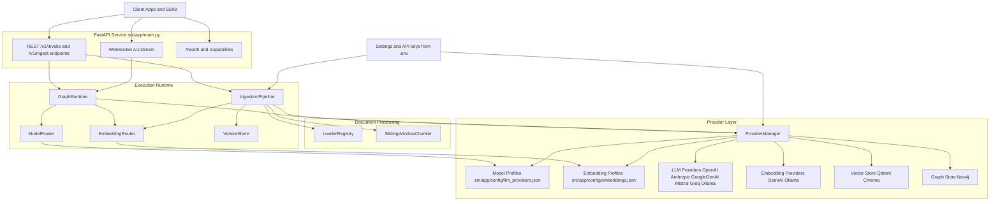

# LangGraph AI Backend (Pluggable)

A reusable backend-first architecture for AI applications with:

- LangGraph runtime (Agent, RAG, GraphRAG modes)
- Pluggable LLM and embedding providers
- Pluggable Vector DB and Graph DB adapters
- File ingestion pipeline with multiple loaders
- REST and WebSocket streaming API (gRPC contract included)

## Current Implementation Scope

This initial implementation provides:

- Project scaffold and module boundaries
- Provider interfaces and centralized provider manager
- JSON-driven LLM model profile registry (backend + model + aliases)
- JSON-driven embedding model profile registry (backend + model + aliases)
- OpenAI, Anthropic, Google GenAI, Mistral, Groq, and Ollama LLM adapters
- OpenAI and Ollama embedding adapters
- Qdrant, Chroma, and Neo4j adapter scaffolds
- Basic graph runner and API endpoints
- WebSocket bidirectional stream endpoint
- Ingestion pipeline skeleton with multi-format loaders

## Architecture Diagram



## Quick Start

### Windows PowerShell (manual)

1. Create and activate a virtual environment:

   ```powershell
   python -m venv .venv
   .\.venv\Scripts\Activate.ps1
   ```

2. Install dependencies:

   ```powershell
   python -m pip install --upgrade pip
   python -m pip install -e .
   ```

3. Copy environment template:

   ```powershell
   Copy-Item .env.example .env
   ```

4. Configure required keys and services in .env (for Neo4j graph mode, set `NEO4J_PASSWORD`).
5. Run the server:

   ```powershell
   uvicorn app.main:app --reload --host 0.0.0.0 --port 8000
   ```

### macOS / Linux

```bash
python3 -m venv .venv
source .venv/bin/activate
python -m pip install --upgrade pip
python -m pip install -e .
cp .env.example .env
uvicorn app.main:app --reload --host 0.0.0.0 --port 8000
```

### Run Without APIs

You can use the runtime without mounting REST or WebSocket routes.

```python
from app.main import create_app

app = create_app(include_rest=False, include_websocket=False, include_meta_routes=False)
```

You can also use the root container directly (no FastAPI app required).

```python
from app.container import get_container

container = get_container()
result = await container.graph_runtime.invoke({"query": "Hello", "mode": "agent"})
```

## API

- GET /health
- GET /capabilities
- POST /v1/invoke
- POST /v1/ingest/upload
- GET /v1/ingest/jobs/{job_id}
- WS /v1/stream

## Notes

- WebSocket streaming is implemented in v1.
- gRPC contract file is included and can be enabled in phase 2.
- LLM model profiles are loaded from `src/app/config/llm_providers.json`.
- Embedding model profiles are loaded from `src/app/config/embeddings.json`.
- LLM profile defaults and enablement are controlled in JSON (`default_provider` + each model `enabled`) instead of environment flags.
- Embedding profile defaults and model selection are controlled in JSON (`default_provider` + each model `enabled`).
- Each profile can define `backend`, `model`, `enabled`, `aliases`, optional `base_url`, and optional `api_key_env`; adding or removing a model is done by editing this JSON.
- `base_url` overrides are currently supported for `openai`, `anthropic`, and `ollama` backends.
- Environment should contain API key variables and service credentials; map each model profile to its key variable through `api_key_env`.
- If `ENABLE_GRAPHDB=true`, set `NEO4J_PASSWORD` in environment configuration.
- Request `provider` can be a profile key (for example `openai_default`) or any configured alias.
- LLM choice precedence: explicit request provider/profile -> configured default profile.
- Optional: set `LLM_PROVIDER_CONFIG_PATH` (or `LLM_MODEL_CONFIG_PATH`) to use a different model profile JSON file.
- Optional: set `EMBEDDING_PROVIDER_CONFIG_PATH` (or `EMBEDDING_MODEL_CONFIG_PATH`) to use a different embedding profile JSON file.
- Vector DB backends available: `qdrant`, `chroma`.
- Exactly one vector backend is active globally via `DEFAULT_VECTOR_STORE` in environment config.
- API payloads do not allow per-request vector backend override.
- Provider calls require valid credentials and reachable external services.
