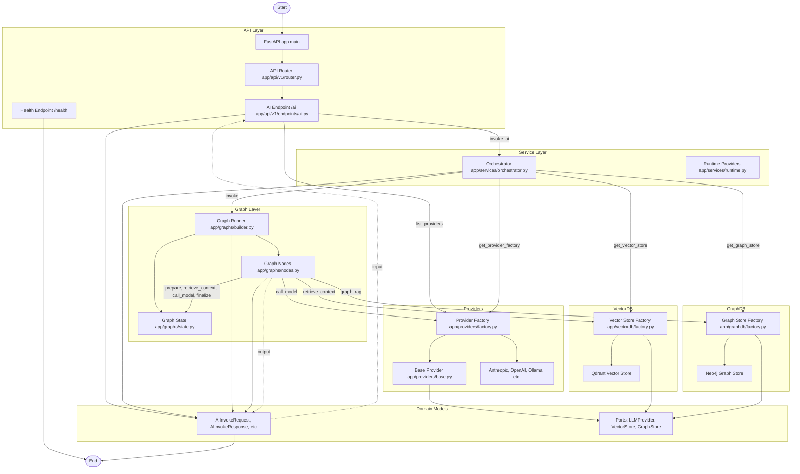

# LangGraph + FastAPI Production Starter

Provider-agnostic FastAPI and LangGraph starter for building production-ready AI APIs with pluggable providers and vector retrieval.

## Overview

### Architecture Highlights

- Provider-agnostic design via `LLMProvider` protocol and provider registry.
- LangGraph orchestration with explicit node boundaries.
- FastAPI API layer separated from orchestration and provider adapters.
- Extensible modules for providers, graph nodes, and vector DB backends.

### Project Structure

```text
app/
  api/
  core/
  domain/
  graphs/
  providers/
  services/
  vectordb/
config/
  providers.json
  embeddings.json
```

## Quick Start

### 1. Create environment and install dependencies

```bash
python -m venv .venv
.venv\Scripts\activate
pip install -e .[dev]
```

### 2. Configure environment

```bash
copy .env.example .env
```

Edit `.env` values as needed.

### 3. Run API

```bash
uvicorn app.main:app --reload
```

### 4. Open API docs

- `http://127.0.0.1:8000/docs`

## Provider Configuration


## Folder Flow Chart

Below is a comprehensive flow diagram showing how all major modules, functions, and workflows are interrelated in this project:



Provider definitions are loaded from `config/providers.json`.

### Supported provider types

- `anthropic`: Anthropic Messages API (`/v1/messages`).
- `openai_compatible`: OpenAI-style chat completions (`/v1/chat/completions`).
- `ollama`: Ollama chat API (`/api/chat`).

Config files support environment placeholders such as `${ANTHROPIC_BASE_URL}`, `${OPENAI_BASE_URL}`, and `${OLLAMA_BASE_URL}`.

### Add or change providers

1. Add or edit provider entries in `config/providers.json`.
2. Set required API key environment variables.
3. Optionally add a dedicated adapter class if the API is not OpenAI-compatible.

## API Usage

### List providers

```bash
curl "http://127.0.0.1:8000/v1/ai/providers"
```

### Invoke model

```bash
curl -X POST "http://127.0.0.1:8000/v1/ai/invoke" \
  -H "Content-Type: application/json" \
  -d '{
    "input": "Summarize LangGraph in one line.",
    "system_prompt": "You are concise.",
    "provider": "openai"
  }'
```

Change `provider` to switch backends per request.

Set global default provider in `.env` via `DEFAULT_PROVIDER`.

## Vector DB Integration (Qdrant)

Workflow with retrieval:

`prepare -> retrieve_context -> call_model -> finalize`

### Run with Docker Compose

```bash
docker compose up --build
```

### Upsert documents

```bash
curl -X POST "http://127.0.0.1:8000/v1/ai/vector/upsert" \
  -H "Content-Type: application/json" \
  -d '{
    "collection": "knowledge_base",
    "documents": [
      {
        "id": "doc-1",
        "text": "LangGraph is used to build stateful LLM workflows.",
        "metadata": {"source": "docs"}
      }
    ]
  }'
```

### Read runtime vector and embedding config

```bash
curl "http://127.0.0.1:8000/v1/ai/vector/config"
```

### Invoke with retrieval enabled

```bash
curl -X POST "http://127.0.0.1:8000/v1/ai/invoke" \
  -H "Content-Type: application/json" \
  -d '{
    "input": "What is LangGraph used for?",
    "provider": "openai",
    "retrieval": {
      "enabled": true,
      "collection": "knowledge_base",
      "top_k": 3
    }
  }'
```

### Vector settings

- `VECTOR_DB_ENABLED=true`
- `VECTOR_DB_PROVIDER=qdrant`
- `VECTOR_DB_DEFAULT_COLLECTION=knowledge_base`
- `QDRANT_URL=http://qdrant:6333`

## Embedding Configuration

Embedding profiles are loaded from `config/embeddings.json`.

### Key environment values

- `EMBEDDINGS_CONFIG_PATH=config/embeddings.json`
- `EMBEDDING_PROFILE=ollama-nomic-embed-text`

### Included profiles

- `openai-text-embedding-3-small`
- `openai-text-embedding-3-large`
- `ollama-nomic-embed-text`
- `ollama-mxbai-embed-large`

Switch embedding behavior by changing only `EMBEDDING_PROFILE`.

Legacy env-based embedding values remain available as fallback if profile lookup fails.

## Production Notes

- Add authN/authZ middleware in `app/main.py`.
- Add tracing and metrics integration in middleware.
- Deploy behind production ASGI setup (for example gunicorn with uvicorn workers).
- Add CI checks for lint and type checks.
