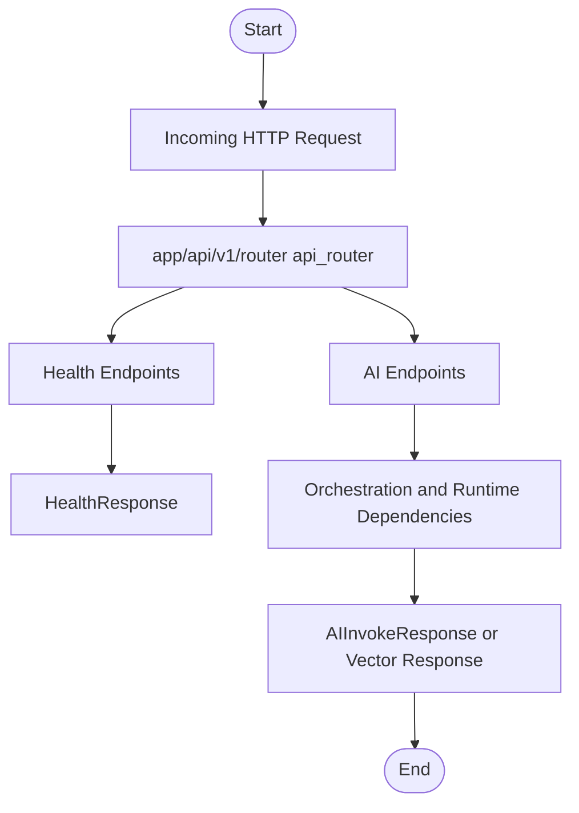

# app/api

API layer package.

## Folder Flow Chart

```mermaid
flowchart TD
  S([Start]) --> A[Incoming HTTP Request]
  A --> B[app/api/v1/router api_router]
  B --> C[Health Endpoints]
  B --> D[AI Endpoints]
  C --> E[HealthResponse]
  D --> F[Orchestration and Runtime Dependencies]
  F --> G[AIInvokeResponse or Vector Response]
  G --> Z([End])
```

## Subfolders

- v1/

## Files

### __init__.py
Package initializer.

No top-level classes or functions.
