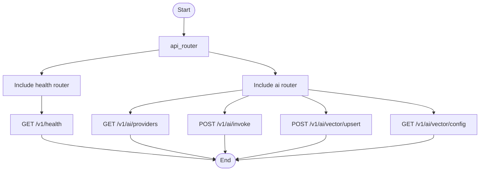

# app/api/v1

Version 1 API router composition.

## Folder Flow Chart

## Subfolders

- endpoints/

## Files

### __init__.py
Package initializer.

No top-level classes or functions.

### router.py
Composes v1 endpoint routers.

#### Top-level Objects

- **api_router (APIRouter)**
  - Input: None
  - Output: APIRouter instance with health and ai routers included.
  - Doc: Root v1 API router composed from endpoint routers.

No top-level functions or classes.

