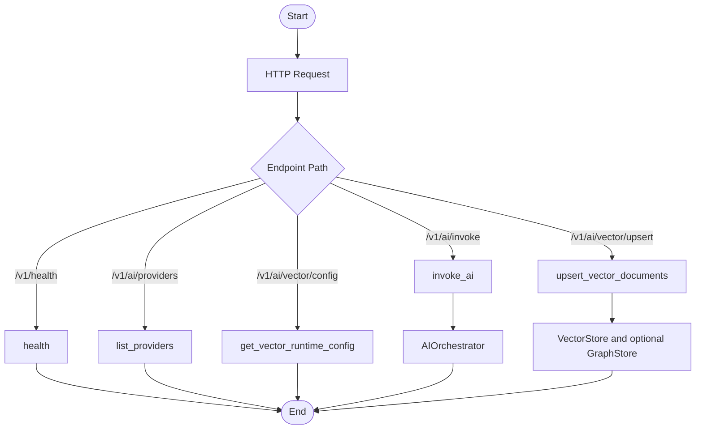

# app/api/v1/endpoints

Version 1 endpoint handlers.

## Folder Flow Chart

## Files

### __init__.py
Package initializer.

No top-level classes or functions.

### health.py
Health-check endpoint.

#### Functions

- **health() -> HealthResponse**
  - Input: None
  - Output: HealthResponse
  - Doc: Returns service health status and service name.

### ai.py
AI invoke and vector endpoints.

#### Functions

- **list_providers(provider_factory: ProviderFactory = Depends(get_provider_factory)) -> ProviderListResponse**
  - Input: ProviderFactory dependency.
  - Output: ProviderListResponse with default provider and provider names.
  - Doc: Lists enabled providers.

- **invoke_ai(request: AIInvokeRequest, orchestrator: AIOrchestrator = Depends(get_orchestrator)) -> AIInvokeResponse**
  - Input: AIInvokeRequest and orchestrator dependency.
  - Output: AIInvokeResponse.
  - Doc: Executes orchestration graph for user input.

- **upsert_vector_documents(request: VectorUpsertRequest, vector_store: VectorStore = Depends(get_vector_store)) -> VectorUpsertResponse**
  - Input: Vector upsert request and vector store dependency.
  - Output: VectorUpsertResponse with collection and upsert count.
  - Doc: Upserts documents into vector DB.

- **get_vector_runtime_config() -> VectorRuntimeConfigResponse**
  - Input: None.
  - Output: VectorRuntimeConfigResponse.
  - Doc: Returns active vector DB and embedding profile runtime settings.
