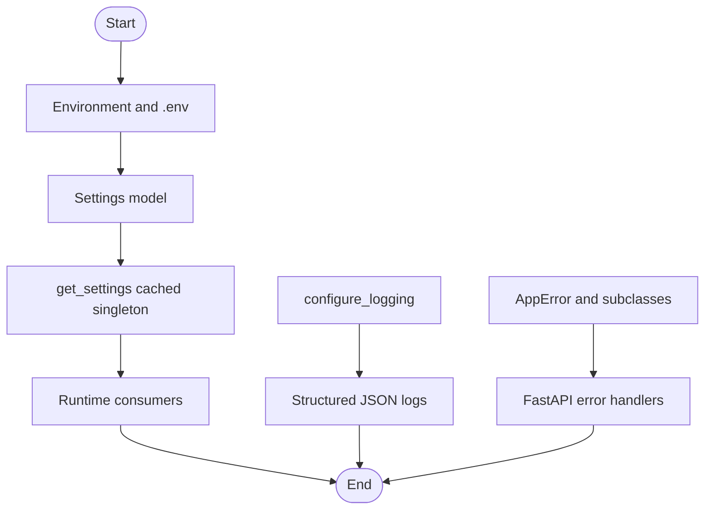

# app/core

Core configuration, logging, and shared exceptions.

## Folder Flow Chart

## Files

### __init__.py
Package initializer.

No top-level classes or functions.

### config.py
Application settings model and cached settings loader.

#### Classes and Functions

- **Settings (BaseSettings)**
  - Pydantic settings model for all app config (env vars, providers, vector DB, embeddings, etc).
  - Fields: app_name, app_env, app_host, app_port, log_level, default_provider, providers_config_path, vector_db_enabled, vector_db_provider, vector_db_default_collection, vector_embedding_size, embeddings_config_path, embedding_profile, embedding_provider, embedding_model, embedding_base_url, embedding_api_key_env, embedding_api_key_prefix, embedding_endpoint_path, embedding_timeout_seconds, qdrant_url, qdrant_api_key_env, qdrant_timeout_seconds, qdrant_distance

- **get_settings() -> Settings**
  - Input: None
  - Output: Settings instance (singleton, cached)
  - Doc: Loads and caches app settings from environment and .env file.

### exceptions.py
Application exception hierarchy.

#### Classes

- **AppError (Exception)**
  - `__init__(message: str, code: str = "app_error")`
    - Input: message (str), code (str, default "app_error")
    - Output: None
    - Doc: Base app exception with message and code.

- **ProviderNotFoundError(AppError)**
  - `__init__(provider: str)`
    - Input: provider (str)
    - Output: None
    - Doc: Raised if provider is not found.

- **ProviderAuthError(AppError)**
  - `__init__(provider: str)`
    - Input: provider (str)
    - Output: None
    - Doc: Raised if provider is missing authentication.

- **ProviderRequestError(AppError)**
  - `__init__(provider: str, message: str)`
    - Input: provider (str), message (str)
    - Output: None
    - Doc: Raised if provider request fails.

### logging.py
Structured logging configuration.

#### Functions

- **configure_logging(level: str) -> None**
  - Input: level (str), log level such as "INFO".
  - Output: None
  - Doc: Configures stdlib and structlog for structured JSON logging to stdout.

