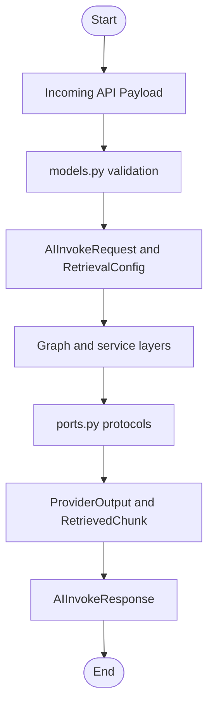

# app/domain

Domain models and protocol interfaces shared across layers.

## Folder Flow Chart

## Files

### __init__.py
Package initializer.

No top-level classes or functions.

### models.py
Request and response schemas for API and orchestration.

#### Classes and Functions

- **RetrievalConfig (BaseModel)**
  - Input fields:
    - `enabled` (bool): Turn retrieval on or off.
    - `collection` (str | None): Optional collection override.
    - `top_k` (int): Number of chunks to retrieve.
    - `score_threshold` (float | None): Optional score cutoff.
  - Output: Validated retrieval config model.

- **AIInvokeRequest (BaseModel)**
  - Input fields:
    - `input` (str): User query text.
    - `system_prompt` (str | None)
    - `provider` (str | None)
    - `model` (str | None)
    - `temperature` (float)
    - `max_tokens` (int | None)
    - `metadata` (dict[str, Any])
    - `retrieval` (RetrievalConfig | None)
  - Output: Validated invoke request model.

- **AIInvokeResponse (BaseModel)**
  - Input fields:
    - `output` (str)
    - `provider` (str)
    - `model` (str | None)
    - `trace_id` (str)
    - `raw` (dict[str, Any] | None)
    - `retrieved_context` (list[RetrievedChunk])
  - Output: Structured API response payload.

- **VectorUpsertRequest (BaseModel)**
  - Input fields:
    - `collection` (str | None)
    - `documents` (list[VectorDocument])
  - Output: Validated upsert payload.

- **VectorUpsertResponse (BaseModel)**
  - Input fields: `collection` (str), `upserted` (int)
  - Output: Upsert result payload.

- **VectorRuntimeConfigResponse (BaseModel)**
  - Input fields: vector DB and embedding runtime fields returned by `/v1/ai/vector/config`.
  - Output: Runtime configuration payload.

- **HealthResponse (BaseModel)**
  - Input fields: `status` (str), `service` (str)
  - Output: Health payload.

- **ProviderInfo (BaseModel)**
  - Input fields: `name` (str)
  - Output: Provider descriptor payload.

- **ProviderListResponse (BaseModel)**
  - Input fields: `default_provider` (str), `providers` (list[ProviderInfo])
  - Output: Provider listing payload.

- **new_trace_id() -> str**
  - Input: None
  - Output: UUID string
  - Doc: Generates a new trace ID for request tracking.

### ports.py
Domain protocols and transport data objects.

#### Classes and Protocol Methods

- **ProviderOutput (BaseModel)**
  - Input fields: `text` (str), `model` (str | None), `raw` (dict[str, Any])
  - Output: Normalized provider output payload.

- **VectorDocument (BaseModel)**
  - Input fields: `id` (str | None), `text` (str), `metadata` (dict[str, Any])
  - Output: Normalized vector document payload.

- **RetrievedChunk (BaseModel)**
  - Input fields: `id` (str), `text` (str), `score` (float), `metadata` (dict[str, Any])
  - Output: Retrieved context chunk payload.

- **LLMProvider (Protocol)**
  - `async generate(user_input, system_prompt, model, temperature, max_tokens, metadata) -> ProviderOutput`
  - Input: Generation parameters and metadata.
  - Output: ProviderOutput.
  - Doc: Interface implemented by concrete LLM providers.

- **VectorStore (Protocol)**
  - `async upsert_documents(collection, documents) -> int`
    - Input: Collection name and vector documents.
    - Output: Number of upserted documents.
  - `async search(collection, query, limit, score_threshold) -> list[RetrievedChunk]`
    - Input: Retrieval query parameters.
    - Output: Ranked retrieved chunks.

