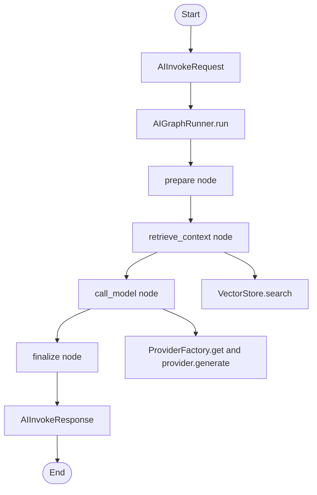

# app/graphs

LangGraph workflow builder, nodes, and execution state.

## Folder Flow Chart

## Files

### __init__.py
Package initializer.

No top-level classes or functions.

### builder.py
Builds and executes the AI graph workflow.

#### Classes and Functions

- **AIGraphRunner**
  - `__init__(provider_factory: ProviderFactory, vector_store: VectorStore, default_collection: str)`
    - Input: Provider factory, vector store, and default collection name.
    - Output: None
    - Doc: Builds and compiles LangGraph workflow with nodes and edges.
  - `async run(request: AIInvokeRequest, trace_id: str) -> AIInvokeResponse`
    - Input: Invoke request and trace ID.
    - Output: Final AIInvokeResponse from graph execution.
    - Doc: Executes graph state machine and returns response object.

### nodes.py
Workflow node implementations.

#### Classes and Functions

- **AINodes**
  - `__init__(provider_factory: ProviderFactory, vector_store: VectorStore, default_collection: str)`
    - Input: Runtime dependencies and default collection.
    - Output: None
    - Doc: Stores shared dependencies used by all graph nodes.
  - `async prepare(state: AIState) -> AIState`
    - Input: Current graph state with request.
    - Output: Partial state update with provider name, model_input, retrieved_context.
    - Doc: Initializes provider selection and model input.
  - `async retrieve_context(state: AIState) -> AIState`
    - Input: Current graph state.
    - Output: Either empty update or retrieved context plus augmented model_input.
    - Doc: Performs vector retrieval and prepends context to model prompt.
  - `async call_model(state: AIState) -> AIState`
    - Input: Current graph state.
    - Output: Partial state update containing provider_output.
    - Doc: Calls selected provider with prompt and generation settings.
  - `async finalize(state: AIState) -> AIState`
    - Input: Current graph state.
    - Output: Partial state update containing final response.
    - Doc: Converts provider output into AIInvokeResponse.

### state.py
Typed state definition used by LangGraph workflow.

#### Types

- **AIState (TypedDict, total=False)**
  - Input keys used during graph execution:
    - `request`, `trace_id`, `provider_name`, `model_input`, `retrieved_context`, `provider_output`
  - Output key:
    - `response` (AIInvokeResponse)
  - Doc: Shared mutable workflow state passed between nodes.

