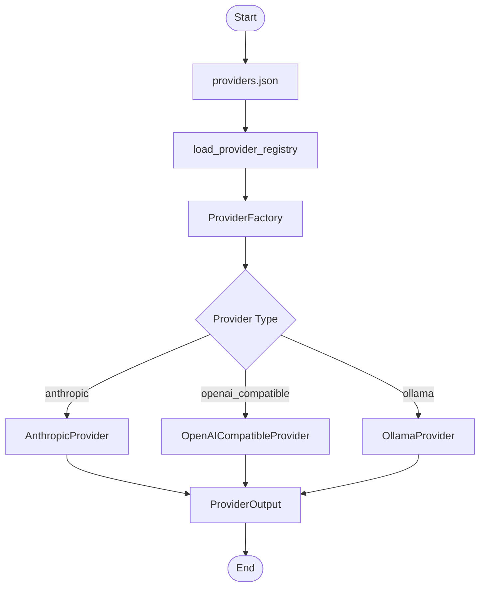

# app/providers

LLM provider adapters and provider factory/registry.

## Folder Flow Chart

## Files

### __init__.py
Package initializer.

No top-level classes or functions.

### base.py
Abstract base provider contract.

#### Classes and Methods

- **BaseProvider (ABC)**
  - `__init__(config: ProviderConfig)`
    - Input: ProviderConfig.
    - Output: None
    - Doc: Stores provider config and provider name.
  - `async generate(user_input, system_prompt, model, temperature, max_tokens, metadata) -> ProviderOutput`
    - Input: Prompt and generation controls.
    - Output: ProviderOutput.
    - Doc: Abstract method implemented by provider adapters.

### anthropic.py
Anthropic provider implementation.

#### Functions and Classes

- **_extract_anthropic_text(payload: dict[str, Any]) -> str**
  - Input: Raw Anthropic response payload.
  - Output: Combined text content.
  - Doc: Extracts text blocks from Anthropic `content` array.

- **AnthropicProvider(BaseProvider)**
  - `async generate(user_input, system_prompt, model, temperature, max_tokens, metadata) -> ProviderOutput`
    - Input: Prompt, controls, and metadata.
    - Output: ProviderOutput with text/model/raw payload.
    - Doc: Calls Anthropic Messages API and normalizes output.

### openai_compatible.py
OpenAI-compatible provider implementation.

#### Functions and Classes

- **_extract_text(payload: dict[str, Any]) -> str**
  - Input: OpenAI-compatible response payload.
  - Output: Extracted text.
  - Doc: Handles string or structured content in choices[0].message.content.

- **OpenAICompatibleProvider(BaseProvider)**
  - `async generate(user_input, system_prompt, model, temperature, max_tokens, metadata) -> ProviderOutput`
    - Input: Prompt, controls, and metadata.
    - Output: ProviderOutput with text/model/raw payload.
    - Doc: Calls OpenAI-compatible chat completions endpoint.

### ollama.py
Ollama provider implementation.

#### Functions and Classes

- **_extract_ollama_text(payload: dict[str, Any]) -> str**
  - Input: Ollama response payload.
  - Output: Extracted text content.
  - Doc: Reads `message.content` and normalizes to string.

- **OllamaProvider(BaseProvider)**
  - `async generate(user_input, system_prompt, model, temperature, max_tokens, metadata) -> ProviderOutput`
    - Input: Prompt, controls, and metadata.
    - Output: ProviderOutput with text/model/raw payload.
    - Doc: Calls Ollama chat endpoint and normalizes output.

### factory.py
Provider instance factory and cache.

#### Classes and Methods

- **ProviderFactory**
  - `__init__(registry: ProviderRegistry, default_provider: str)`
    - Input: Provider registry and default provider name.
    - Output: None
    - Doc: Builds enabled provider lookup and instance cache.
  - `list_providers() -> list[str]`
    - Input: None
    - Output: Sorted provider names.
    - Doc: Returns enabled provider names.
  - `get(name: str | None = None) -> LLMProvider`
    - Input: Optional provider name.
    - Output: Provider instance.
    - Doc: Returns cached provider instance or builds one.
  - `_build(config: ProviderConfig) -> LLMProvider`
    - Input: Provider config.
    - Output: Concrete provider adapter instance.
    - Doc: Selects adapter class by provider `type`.

### registry.py
Provider registry config schema and JSON loader.

#### Classes and Functions

- **ProviderConfig (BaseModel)**
  - Input fields: name, type, enabled, base_url, api_key_env, api_key_prefix, endpoint_path, default_model, timeout_seconds, extra_headers
  - Output: Validated provider config item.

- **ProviderRegistry (BaseModel)**
  - Input fields: `providers` (list[ProviderConfig])
  - Output: Validated provider registry.

- **_resolve_env_vars(value: Any) -> Any**
  - Input: Nested config value.
  - Output: Value with `${ENV_NAME}` placeholders resolved.
  - Doc: Recursively resolves env placeholders in JSON config.

- **load_provider_registry(config_path: str) -> ProviderRegistry**
  - Input: Path to provider JSON file.
  - Output: ProviderRegistry.
  - Doc: Loads provider definitions from JSON into typed models.

