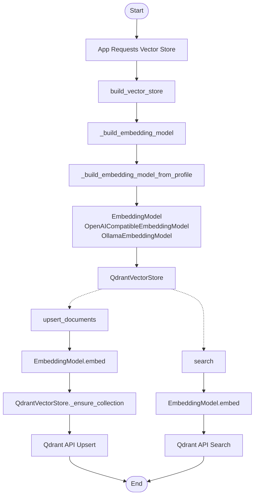

# app/vectordb

Vector database abstractions, embedding backends, and Qdrant vector store implementation.

## Folder Flow Chart

## Files

### __init__.py
Exports the vector store builder function.

Top-level symbols:
- build_vector_store

### embedding.py
Embedding protocol and backends.

#### Classes and Functions

- **EmbeddingModel (Protocol)**
  - `async embed(text: str) -> list[float]`
    - Input: text (str), text to embed.
    - Output: List of floats (embedding vector).
    - Doc: Protocol for embedding models.

- **OpenAICompatibleEmbeddingModel**
  - `__init__(base_url, model, timeout_seconds, api_key_env, api_key_prefix, endpoint_path, extra_headers=None)`
    - Input: Model and API config params.
    - Output: None
    - Doc: Embedding model using OpenAI-compatible API.
  - `async embed(text: str) -> list[float]`
    - Input: text (str)
    - Output: List of floats (embedding vector)
    - Doc: Calls OpenAI-compatible API to get embedding.

- **OllamaEmbeddingModel**
  - `__init__(base_url, model, timeout_seconds, endpoint_path)`
    - Input: Model and API config params.
    - Output: None
    - Doc: Embedding model using Ollama API.
  - `async embed(text: str) -> list[float]`
    - Input: text (str)
    - Output: List of floats (embedding vector)
    - Doc: Calls Ollama API to get embedding.

### factory.py
Builds a QdrantVectorStore and embedding backend from settings/profile.

#### Functions

- **build_vector_store(settings: Settings) -> QdrantVectorStore**
  - Input: settings (Settings), app config.
  - Output: QdrantVectorStore instance.
  - Doc: Builds and returns a configured QdrantVectorStore with the appropriate embedding model.

- **_build_embedding_model(settings: Settings) -> EmbeddingModel**
  - Input: settings (Settings)
  - Output: EmbeddingModel instance
  - Doc: Selects embedding model from the configured profile.

- **_build_embedding_model_from_profile(profile: EmbeddingConfig) -> EmbeddingModel**
  - Input: profile (EmbeddingConfig)
  - Output: EmbeddingModel instance
  - Doc: Instantiates embedding model from profile.

### qdrant.py
Qdrant-backed vector store implementation.

#### Classes and Functions

- **QdrantVectorStore**
  - `__init__(base_url, api_key, timeout_seconds, distance, embedding_model)`
    - Input: Qdrant and embedding model config params.
    - Output: None
    - Doc: Stores config and prepares HTTP headers.
  - `async _ensure_collection(collection: str, vector_size: int)`
    - Input: collection (str), vector_size (int)
    - Output: None
    - Doc: Ensures Qdrant collection exists with correct vector size.
  - `async upsert_documents(collection: str, documents: list[VectorDocument]) -> int`
    - Input: collection (str), documents (list)
    - Output: Number of documents upserted (int)
    - Doc: Embeds and upserts documents into Qdrant collection.
  - `async search(collection: str, query: str, limit: int, score_threshold: float | None) -> list[RetrievedChunk]`
    - Input: Query params
    - Output: List of RetrievedChunk
    - Doc: Embeds query, searches Qdrant, returns matching chunks.

### registry.py
Embedding profile schema and JSON loader.

#### Classes and Functions

- **EmbeddingConfig**
  - Pydantic model for embedding profile config.
  - Fields: name, type, enabled, model, base_url, endpoint_path, timeout_seconds, api_key_env, api_key_prefix, vector_size, extra_headers

- **EmbeddingRegistry**
  - Pydantic model for embedding registry (list of EmbeddingConfig)

- **resolve_env_vars(value: Any) -> Any**
  - Input: Any value (dict, list, str)
  - Output: Value with env vars resolved
  - Doc: Recursively resolves ${ENV} strings to environment values.

- **load_embedding_registry(config_path: str) -> EmbeddingRegistry**
  - Input: Path to config JSON
  - Output: EmbeddingRegistry instance
  - Doc: Loads embedding registry from JSON config file.

