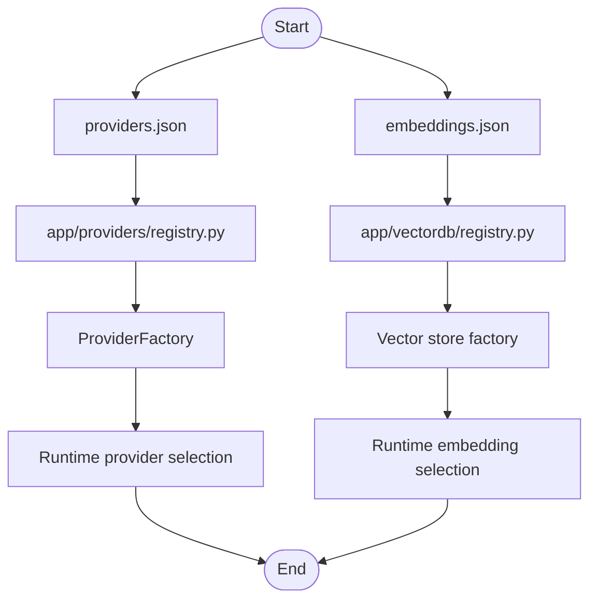

# config

Runtime JSON configuration files for providers and embeddings.

## Folder Flow Chart

## Files

### providers.json
Provider catalog used by provider registry/factory.

No Python functions or classes.

### embeddings.json
Embedding profile catalog used by vector DB embedding registry.

No Python functions or classes.
